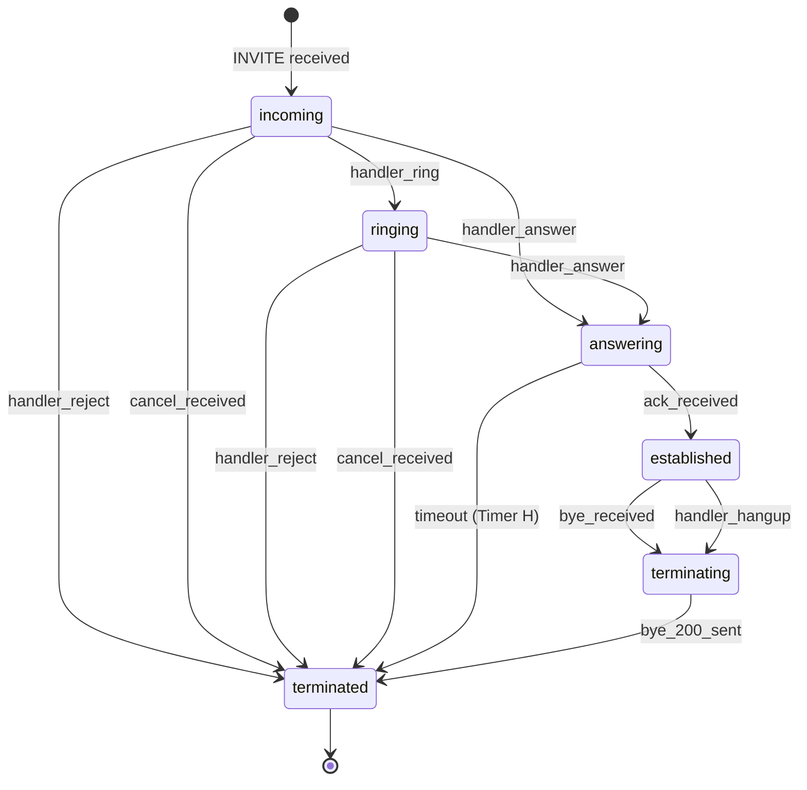
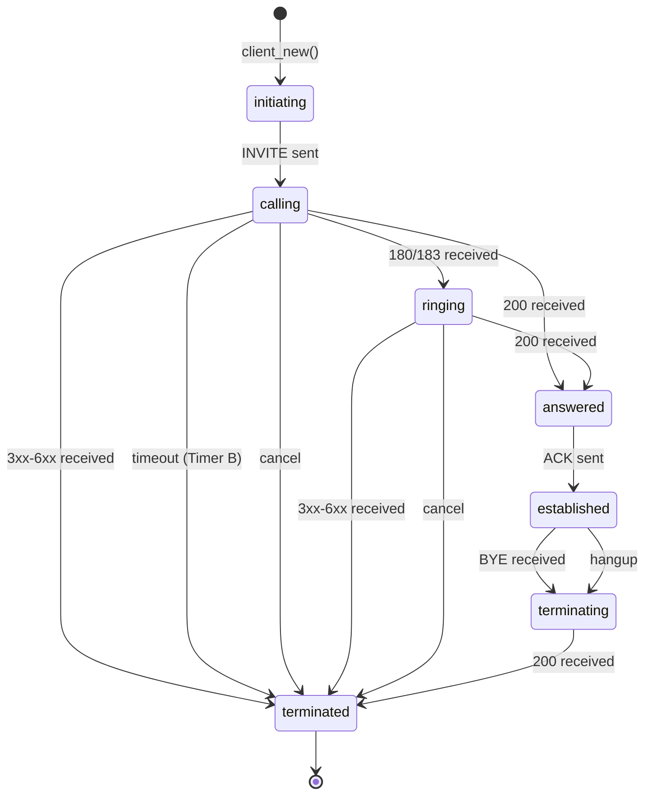
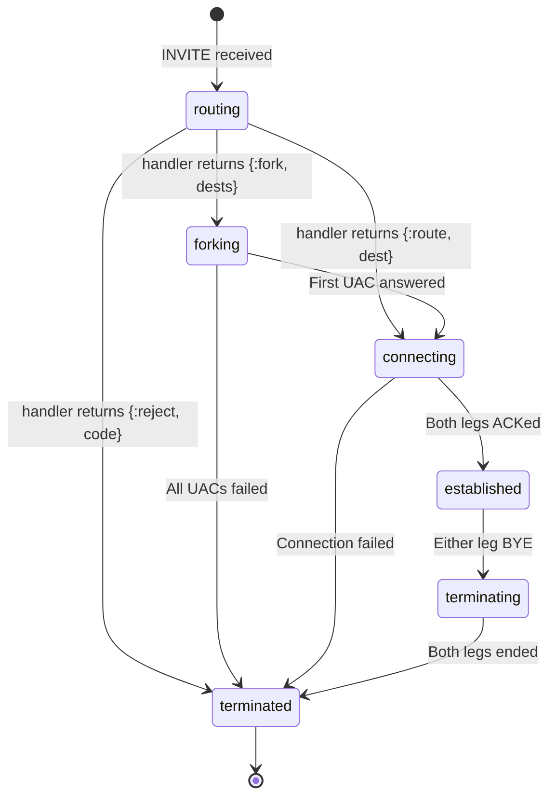
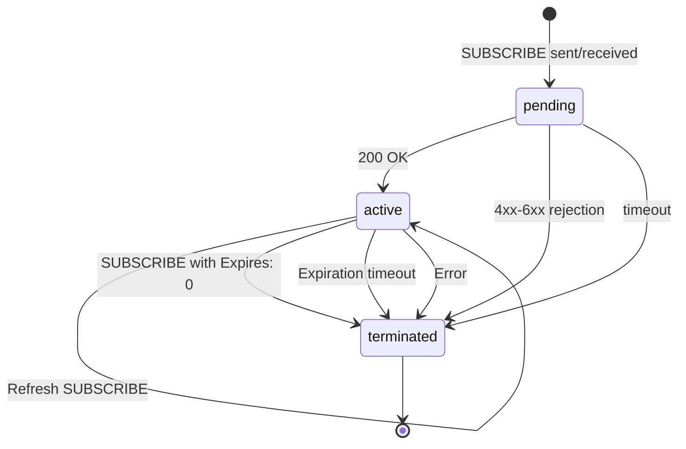

# State Machine Specifications

**Version:** 1.0.0-draft
**Status:** DRAFT
**Date:** 2025-12-03

## 1. Notation and Conventions

### 1.1 State Machine Notation

This document uses **formal state machine notation** with:

```
State Machine: M = (S, s₀, Σ, δ, F)
where:
  S  = Set of states
  s₀ = Initial state
  Σ  = Set of input events
  δ  = State transition function: S × Σ → S
  F  = Set of final/terminal states
```

### 1.2 Transition Table Format

```
| Current State | Event | Guards | Actions | Next State |
```

Where:
- **Guards**: Conditions that must be true
- **Actions**: Side effects performed during transition
- **Next State**: Resulting state (or `same` if no transition)

### 1.3 Event Notation

Events use the format: `{type, payload}`

Types:
- `:call` - Synchronous GenServer call
- `:cast` - Asynchronous GenServer cast
- `:info` - Erlang message
- `:timeout` - State timeout
- `:enter` - State entry action

---

## 2. UAS (User Agent Server) State Machine

### 2.1 Formal Definition

```
UAS = (S_uas, s₀, Σ_uas, δ_uas, F_uas)

S_uas = {incoming, ringing, answering, established, terminating, terminated}
s₀ = incoming
Σ_uas = {handler_ring, handler_answer, handler_reject, ack_received,
         bye_received, bye_sent, cancel_received, error}
F_uas = {terminated}
```

### 2.2 State Diagram



### 2.3 Complete Transition Table

#### State: `:incoming`

Entity just created from incoming INVITE. Handler must decide: ring, answer, or reject.

| Event | Payload | Guards | Actions | Next State |
|-------|---------|--------|---------|------------|
| `{:call, from, {:ring, opts}}` | Options map | - | Send 180 Ringing<br>Reply to caller: `:ok` | `:ringing` |
| `{:call, from, {:answer, sdp}}` | SDP body | SDP valid | Send 200 OK with SDP<br>Start Timer H (32s)<br>Reply to caller: `:ok` | `:answering` |
| `{:call, from, {:reject, code, reason}}` | Status code, reason | code ≥ 300 | Send error response<br>Reply to caller: `:ok` | `:terminated` |
| `{:cast, {:cancel_received}}` | - | - | Send 487 to INVITE<br>Send 200 to CANCEL<br>Notify owner: `{:uas_cancelled, self()}` | `:terminated` |
| `{:timeout, :handler_decision}` | - | - | Send 408 Request Timeout | `:terminated` |

#### State: `:ringing`

180 Ringing sent. Handler can now answer or reject.

| Event | Payload | Guards | Actions | Next State |
|-------|---------|--------|---------|------------|
| `{:call, from, {:answer, sdp}}` | SDP body | SDP valid | Send 200 OK with SDP<br>Start Timer H<br>Reply: `:ok` | `:answering` |
| `{:call, from, {:reject, code, reason}}` | Status code, reason | code ≥ 300 | Send error response<br>Reply: `:ok` | `:terminated` |
| `{:call, from, {:progress, code}}` | Status code | 180 ≤ code < 200 | Send 18x response<br>Reply: `:ok` | `:ringing` |
| `{:cast, {:cancel_received}}` | - | - | Send 487 to INVITE<br>Send 200 to CANCEL | `:terminated` |

#### State: `:answering`

200 OK sent, waiting for ACK. Timer H (32s) is running in Dialog/Transaction layer.

| Event | Payload | Guards | Actions | Next State |
|-------|---------|--------|---------|------------|
| `{:enter, :answering}` | - | - | Call Dialog.set_owner/2<br>Dialog monitors UAS | `:answering` |
| `{:info, {:dialog_event, :ack_received}}` | - | - | Notify owner: `{:uas_established, self()}` | `:established` |
| `{:info, {:dialog_event, :timer_h_timeout}}` | - | - | Log timeout<br>Notify owner: `{:uas_timeout, self()}` | `:terminated` |
| `{:info, {:dialog_event, {:retransmit_invite}}}` | - | - | Retransmit 200 OK | `:answering` |

#### State: `:established`

ACK received, call is active. Can send/receive re-INVITE, receive BYE.

| Event | Payload | Guards | Actions | Next State |
|-------|---------|--------|---------|------------|
| `{:info, {:dialog_event, {:bye_received, bye_msg}}}` | BYE message | - | Send 200 OK to BYE<br>Notify owner: `{:uas_bye, self(), bye_msg}` | `:terminating` |
| `{:call, from, {:hangup}}` | - | - | Send BYE<br>Reply: `:ok` | `:terminating` |
| `{:info, {:dialog_event, {:reinvite, invite}}}` | re-INVITE msg | - | Notify owner: `{:uas_reinvite, self(), invite}`<br>Handler decides answer/reject | `:established` |
| `{:cast, {:send_reinvite, sdp}}` | New SDP | - | Send re-INVITE with SDP | `:established` |

#### State: `:terminating`

BYE sent or received, cleaning up.

| Event | Payload | Guards | Actions | Next State |
|-------|---------|--------|---------|------------|
| `{:info, {:dialog_event, {:bye_200}}}` | - | - | Cleanup resources<br>Notify owner: `{:uas_terminated, self()}` | `:terminated` |
| `{:timeout, :cleanup}` | - | - | Force cleanup | `:terminated` |

#### State: `:terminated`

Terminal state. Process will exit soon.

| Event | Payload | Guards | Actions | Next State |
|-------|---------|--------|---------|------------|
| `{:enter, :terminated}` | - | - | Unregister from registry<br>Schedule stop after 1s | `:terminated` |

### 2.4 Data Structure

```elixir
defmodule ParrotSip.UAS.Data do
  @type t :: %__MODULE__{
    id: String.t(),
    dialog_id: String.t(),            # Deterministic dialog ID for Registry lookup
    dialog: pid(),                    # DialogStatem process
    invite: Message.t(),              # Original INVITE
    owner: pid(),                     # B2BUA.Session or handler
    notify_fun: function(),           # Callback: (event, uas_pid) -> :ok
    timers: %{
      handler_decision: reference() | nil,
      cleanup: reference() | nil
    },
    metadata: map()                   # Application data
  }
end
```

### 2.5 Invariants

**INV-UAS-1:** MUST send exactly one final response to INVITE (200-699)
**INV-UAS-2:** MUST wait for ACK before transitioning to established
**INV-UAS-3:** MUST implement Timer H (32s ACK wait)
**INV-UAS-4:** MUST retransmit 200 OK if INVITE retransmitted (before ACK)
**INV-UAS-5:** MUST notify owner on all state transitions

---

## 3. UAC (User Agent Client) State Machine

### 3.1 Formal Definition

```
UAC = (S_uac, s₀, Σ_uac, δ_uac, F_uac)

S_uac = {initiating, calling, ringing, answered, established, terminating, terminated}
s₀ = initiating
Σ_uac = {invite_sent, response_1xx, response_2xx, response_3xx_6xx,
         ack_sent, cancel, bye_received, bye_sent, timeout}
F_uac = {terminated}
```

### 3.2 State Diagram



### 3.3 Complete Transition Table

#### State: `:initiating`

Building INVITE request with SDP negotiation.

| Event | Payload | Guards | Actions | Next State |
|-------|---------|--------|---------|------------|
| `{:enter, :initiating}` | - | - | Build INVITE message<br>Create dialog (early state) | `:initiating` |
| `{:cast, :send_invite}` | - | Dialog created | Send INVITE via Transaction.Client<br>Start Timer B (32s) | `:calling` |

#### State: `:calling`

INVITE sent, waiting for response. Timer B running.

| Event | Payload | Guards | Actions | Next State |
|-------|---------|--------|---------|------------|
| `{:info, {:tx_response, {100, _}}}` | 100 Trying | - | Stop Timer A<br>Continue waiting | `:calling` |
| `{:info, {:tx_response, {code, resp}}}` | 180/183/etc | 180 ≤ code < 200 | Notify owner: `{:uac_ringing, self(), code, resp}`<br>Update dialog (remote tag) | `:ringing` |
| `{:info, {:tx_response, {200, resp}}}` | 200 OK | - | Stop Timer B<br>Send ACK<br>Notify owner: `{:uac_answered, self(), resp.body}` | `:answered` |
| `{:info, {:tx_response, {code, resp}}}` | 3xx-6xx | code ≥ 300 | Send ACK<br>Notify owner: `{:uac_rejected, self(), code, resp}` | `:terminated` |
| `{:call, from, :cancel}` | - | - | Send CANCEL<br>Reply: `:ok` | `:calling` |
| `{:timeout, :timer_b}` | - | - | Notify owner: `{:uac_timeout, self()}`<br>Stop transaction | `:terminated` |

#### State: `:ringing`

Received 18x, call is ringing. Can still be cancelled.

| Event | Payload | Guards | Actions | Next State |
|-------|---------|--------|---------|------------|
| `{:info, {:tx_response, {code, resp}}}` | 18x | 180 ≤ code < 200 | Notify owner: `{:uac_progress, self(), code, resp}` | `:ringing` |
| `{:info, {:tx_response, {200, resp}}}` | 200 OK | - | Send ACK<br>Notify owner: `{:uac_answered, self(), resp.body}` | `:answered` |
| `{:info, {:tx_response, {code, resp}}}` | 3xx-6xx | code ≥ 300 | Send ACK<br>Notify owner: `{:uac_rejected, self(), code, resp}` | `:terminated` |
| `{:call, from, :cancel}` | - | - | Send CANCEL<br>Wait for 487<br>Reply: `:ok` | `:ringing` |

#### State: `:answered`

200 OK received, sending ACK. Brief transitional state.

| Event | Payload | Guards | Actions | Next State |
|-------|---------|--------|---------|------------|
| `{:info, :ack_sent}` | - | - | Confirm dialog<br>Notify owner: `{:uac_established, self()}` | `:established` |

#### State: `:established`

Call active. Can send/receive re-INVITE, send/receive BYE.

| Event | Payload | Guards | Actions | Next State |
|-------|---------|--------|---------|------------|
| `{:info, {:dialog_event, {:bye_received, bye}}}` | BYE message | - | Send 200 OK<br>Notify owner: `{:uac_bye, self(), bye}` | `:terminating` |
| `{:call, from, :hangup}` | - | - | Send BYE<br>Reply: `:ok` | `:terminating` |
| `{:call, from, {:reinvite, sdp}}` | New SDP | - | Send re-INVITE<br>Reply: `:ok` | `:established` |
| `{:info, {:dialog_event, {:reinvite, invite}}}` | re-INVITE | - | Notify owner: `{:uac_reinvite, self(), invite}` | `:established` |

#### State: `:terminating`

BYE sent or received, waiting for final 200.

| Event | Payload | Guards | Actions | Next State |
|-------|---------|--------|---------|------------|
| `{:info, {:dialog_event, {:bye_200}}}` | - | - | Notify owner: `{:uac_terminated, self()}` | `:terminated` |
| `{:timeout, :cleanup}` | - | - | Force cleanup | `:terminated` |

#### State: `:terminated`

Terminal state.

| Event | Payload | Guards | Actions | Next State |
|-------|---------|--------|---------|------------|
| `{:enter, :terminated}` | - | - | Unregister<br>Stop dialog<br>Schedule exit | `:terminated` |

### 3.4 Data Structure

```elixir
defmodule ParrotSip.UAC.Data do
  @type t :: %__MODULE__{
    id: String.t(),
    dialog: pid(),
    dest_uri: String.t(),
    local_sdp: String.t(),
    remote_sdp: String.t() | nil,
    owner: pid(),
    notify_fun: function(),
    timers: %{
      timer_b: reference() | nil,
      cleanup: reference() | nil
    },
    metadata: map()
  }
end
```

### 3.5 Invariants

**INV-UAC-1:** MUST send ACK for all final responses (2xx-6xx)
**INV-UAC-2:** MUST implement Timer B (32s INVITE timeout)
**INV-UAC-3:** CANCEL MUST only be sent in calling/ringing states
**INV-UAC-4:** MUST notify owner on all state transitions
**INV-UAC-5:** ACK for 2xx sent via dialog, ACK for non-2xx via transaction

---

## 4. B2BUA Session State Machine

### 4.1 Formal Definition

```
Session = (S_session, s₀, Σ_session, δ_session, F_session)

S_session = {routing, forking, connecting, established, terminating, terminated}
s₀ = routing
Σ_session = {uas_created, route_decision, uac_answered, uas_established,
             leg_bye, leg_failed, cancel}
F_session = {terminated}
```

### 4.2 State Diagram



### 4.3 Complete Transition Table

#### State: `:routing`

A-leg (UAS) created, calling handler for routing decision.

| Event | Payload | Guards | Actions | Next State |
|-------|---------|--------|---------|------------|
| `{:enter, :routing}` | - | - | Create UAS entity<br>Call handler.route_call() | `:routing` |
| `{:cast, {:handler_decision, {:fork, dests}}}` | Dest URIs | length(dests) > 1 | UAS.ring(a_leg)<br>Create UAC for each dest<br>Store all b_legs | `:forking` |
| `{:cast, {:handler_decision, {:route, dest}}}` | Single dest | - | UAS.ring(a_leg)<br>Create one UAC<br>Store b_leg | `:connecting` |
| `{:cast, {:handler_decision, {:reject, code, reason}}}` | Status code | - | UAS.reject(a_leg, code, reason) | `:terminated` |

#### State: `:forking`

Multiple B-legs (UACs) trying simultaneously. First to answer wins.

| Event | Payload | Guards | Actions | Next State |
|-------|---------|--------|---------|------------|
| `{:info, {:uac_answered, uac_pid, sdp}}` | UAC pid, SDP | UAC in b_legs | Cancel all other UACs<br>Call handler.modify_sdp(sdp)<br>UAS.answer(a_leg, modified_sdp)<br>Set active_b_leg | `:connecting` |
| `{:info, {:uac_rejected, uac_pid, code}}` | UAC pid, code | - | Remove from b_legs<br>Check if any remaining | `:forking` or `:terminated` |
| `{:info, {:uac_timeout, uac_pid}}` | UAC pid | - | Remove from b_legs | `:forking` or `:terminated` |
| `{:cast, {:all_uacs_failed}}` | - | b_legs == [] | UAS.reject(a_leg, 480, "Temporarily Unavailable") | `:terminated` |

#### State: `:connecting`

B-leg answered, A-leg answering. Waiting for both ACKs.

| Event | Payload | Guards | Actions | Next State |
|-------|---------|--------|---------|------------|
| `{:info, {:uas_established, uas_pid}}` | - | - | Mark a_leg established<br>Check if both ready | `:connecting` or `:established` |
| `{:info, {:uac_established, uac_pid}}` | - | - | Mark b_leg established<br>Check if both ready | `:connecting` or `:established` |
| `{:cast, :both_established}` | - | - | Call handler.handle_established()<br>Start media proxy if needed | `:established` |
| `{:info, {:leg_failed, leg_pid}}` | - | - | Terminate other leg | `:terminated` |

#### State: `:established`

Both legs active, call in progress. Forward signals between legs.

| Event | Payload | Guards | Actions | Next State |
|-------|---------|--------|---------|------------|
| `{:info, {:uas_bye, uas_pid, bye}}` | - | - | Call handler.handle_hangup()<br>UAC.hangup(active_b_leg) | `:terminating` |
| `{:info, {:uac_bye, uac_pid, bye}}` | - | - | Call handler.handle_hangup()<br>UAS.hangup(a_leg) | `:terminating` |
| `{:info, {:uas_reinvite, uas_pid, invite}}` | re-INVITE | - | Call handler.modify_sdp()<br>UAC.reinvite(b_leg, modified_sdp) | `:established` |
| `{:info, {:uac_reinvite, uac_pid, invite}}` | re-INVITE | - | Call handler.modify_sdp()<br>UAS.send_reinvite(a_leg, modified_sdp) | `:established` |

#### State: `:terminating`

One or both legs ending. Ensure both terminate.

| Event | Payload | Guards | Actions | Next State |
|-------|---------|--------|---------|------------|
| `{:info, {:uas_terminated, _}}` | - | - | Mark a_leg done<br>Check if both done | `:terminating` or `:terminated` |
| `{:info, {:uac_terminated, _}}` | - | - | Mark b_leg done<br>Check if both done | `:terminating` or `:terminated` |
| `{:cast, :both_terminated}` | - | - | Stop media proxy<br>Call handler.handle_ended() | `:terminated` |
| `{:timeout, :force_cleanup}` | - | - | Force stop all legs | `:terminated` |

#### State: `:terminated`

Session complete.

| Event | Payload | Guards | Actions | Next State |
|-------|---------|--------|---------|------------|
| `{:enter, :terminated}` | - | - | Cleanup resources<br>Unregister session<br>Schedule stop | `:terminated` |

### 4.4 Data Structure

```elixir
defmodule ParrotSip.B2BUA.Session.Data do
  @type t :: %__MODULE__{
    session_id: String.t(),
    a_leg: %{
      uas: pid(),
      dialog: pid(),
      established: boolean()
    },
    b_legs: [%{
      uac: pid(),
      dialog: pid(),
      dest: String.t(),
      status: :trying | :ringing | :answered | :established | :failed
    }],
    active_b_leg: pid() | nil,
    handler_module: module(),
    handler_state: term(),
    media_proxy: pid() | nil,
    start_time: DateTime.t(),
    metadata: map()
  }
end
```

### 4.5 Invariants

**INV-SESSION-1:** MUST terminate all legs when session ends
**INV-SESSION-2:** In forking, MUST cancel non-winning UACs
**INV-SESSION-3:** MUST call handler for all routing decisions
**INV-SESSION-4:** MUST call handler for SDP manipulation
**INV-SESSION-5:** MUST ensure both legs established before :established state

---

## 5. Timer Requirements

### 5.1 RFC 3261 Timers (Handled by Transaction Layer)

These are implemented in existing `TransactionStatem`:
- Timer A, B, C, D (INVITE client)
- Timer E, F (non-INVITE client)
- Timer G, H, I (INVITE server)
- Timer J, K (non-INVITE server)

### 5.2 Application Timers (New)

#### UAS Timers

| Timer | State | Duration | Purpose | Action on Timeout |
|-------|-------|----------|---------|-------------------|
| handler_decision | incoming | 10s | Handler must decide | Send 408, terminate |
| cleanup | terminating | 5s | Final cleanup | Force terminate |

**Note:** Timer H (32s ACK wait) is owned by the Transaction/Dialog layer per RFC 3261, not UAS. UAS receives `{:dialog_event, :timer_h_timeout}` if it fires.

#### UAC Timers

| Timer | State | Duration | Purpose | Action on Timeout |
|-------|-------|----------|---------|-------------------|
| timer_b | calling | 32s | INVITE response (also in tx) | Notify owner, terminate |
| cleanup | terminating | 5s | Final cleanup | Force terminate |

#### Session Timers

| Timer | State | Duration | Purpose | Action on Timeout |
|-------|-------|----------|---------|-------------------|
| routing | routing | 15s | Handler routing decision | Reject with 480 |
| connecting | connecting | 30s | Both legs establish | Terminate session |
| force_cleanup | terminating | 10s | Final cleanup | Force stop all |

---

## 6. State Machine Properties

### 6.1 Liveness Properties

**L-1:** Every call eventually reaches a terminal state (terminated)
**L-2:** No infinite loops or deadlocks possible
**L-3:** All timers eventually fire or are cancelled

### 6.2 Safety Properties

**S-1:** Never send duplicate final responses
**S-2:** Never transition to invalid states
**S-3:** Never lose INVITE (must respond)
**S-4:** ACK always sent for final responses

### 6.3 Determinism

**D-1:** Given state S and event E, next state is deterministic
**D-2:** Guard conditions are mutually exclusive
**D-3:** No race conditions between state transitions

---

## 6. Subscription Entity State Machine

### 6.1 Formal Definition

```
Subscription = (S_sub, s₀, Σ_sub, δ_sub, F_sub)

S_sub = {pending, active, terminated}
s₀ = pending
Σ_sub = {subscribe_sent, subscribe_received, response_2xx, response_4xx_6xx,
         notify_received, refresh, expire, unsubscribe}
F_sub = {terminated}
```

### 6.2 State Diagram



### 6.3 Role Types

Subscriptions have two roles:

**Subscriber Role** (UAC-like):
- Sends SUBSCRIBE requests
- Receives NOTIFY messages
- Manages subscription refresh

**Notifier Role** (UAS-like):
- Receives SUBSCRIBE requests
- Sends NOTIFY messages
- Manages subscription state

### 6.4 Complete Transition Table - Subscriber Role

#### State: `:pending` (Subscriber)

SUBSCRIBE sent, waiting for acceptance.

| Event | Payload | Guards | Actions | Next State |
|-------|---------|--------|---------|------------|
| `{:enter, :pending}` | - | - | Build SUBSCRIBE request<br>Send via Transaction.Client<br>Start expiration timer | `:pending` |
| `{:info, {:tx_response, {200, resp}}}` | 200 OK | - | Parse Expires header<br>Schedule refresh<br>Notify owner: `{:subscription_active, self()}` | `:active` |
| `{:info, {:tx_response, {202, resp}}}` | 202 Accepted | - | Wait for NOTIFY | `:pending` |
| `{:info, {:tx_response, {code, resp}}}` | 4xx-6xx | code ≥ 300 | Notify owner: `{:subscription_rejected, self(), code}` | `:terminated` |
| `{:info, {:notify_received, notify}}` | NOTIFY | - | Process initial state<br>Send 200 OK to NOTIFY<br>Transition to active | `:active` |
| `{:timeout, :subscribe_timeout}` | - | - | Notify owner: `{:subscription_timeout, self()}` | `:terminated` |

#### State: `:active` (Subscriber)

Subscription active, receiving NOTIFYs.

| Event | Payload | Guards | Actions | Next State |
|-------|---------|--------|---------|------------|
| `{:info, {:notify_received, notify}}` | NOTIFY | - | Parse event state<br>Send 200 OK<br>Notify owner: `{:notify, self(), state, body}` | `:active` |
| `{:info, {:notify_received, %{subscription_state: "terminated"}}}` | Final NOTIFY | - | Send 200 OK<br>Notify owner: `{:subscription_terminated, self()}` | `:terminated` |
| `{:timeout, :refresh}` | - | - | Send refresh SUBSCRIBE<br>Reschedule refresh | `:active` |
| `{:call, from, :unsubscribe}` | - | - | Send SUBSCRIBE Expires: 0<br>Reply: `:ok` | `:active` |
| `{:timeout, :expires}` | - | - | Notify owner: `{:subscription_expired, self()}` | `:terminated` |

#### State: `:terminated` (Subscriber)

Subscription ended.

| Event | Payload | Guards | Actions | Next State |
|-------|---------|--------|---------|------------|
| `{:enter, :terminated}` | - | - | Cancel timers<br>Cleanup resources<br>Schedule stop | `:terminated` |

### 6.5 Complete Transition Table - Notifier Role

#### State: `:pending` (Notifier)

SUBSCRIBE received, application deciding whether to accept.

| Event | Payload | Guards | Actions | Next State |
|-------|---------|--------|---------|------------|
| `{:enter, :pending}` | - | - | Create dialog<br>Start handler decision timer | `:pending` |
| `{:call, from, {:accept, opts}}` | Accept options | - | Send 200 OK<br>Set expiration<br>Send initial NOTIFY<br>Reply: `:ok` | `:active` |
| `{:call, from, {:reject, code, reason}}` | Status code | code ≥ 300 | Send error response<br>Reply: `:ok` | `:terminated` |
| `{:timeout, :handler_decision}` | - | - | Send 408 Timeout | `:terminated` |

#### State: `:active` (Notifier)

Subscription active, sending NOTIFYs when state changes.

| Event | Payload | Guards | Actions | Next State |
|-------|---------|--------|---------|------------|
| `{:call, from, {:notify, state, body}}` | Event state, body | - | Build NOTIFY<br>Send via dialog<br>Reply: `:ok` | `:active` |
| `{:info, {:dialog_event, {:subscribe_refresh, sub}}}` | Refresh SUBSCRIBE | - | Send 200 OK<br>Update expiration<br>Reschedule expire timer | `:active` |
| `{:info, {:dialog_event, {:subscribe_unsubscribe}}}` | SUBSCRIBE Expires: 0 | - | Send 200 OK<br>Send final NOTIFY (terminated)<br>Notify owner: `{:subscription_ended, self()}` | `:terminated` |
| `{:timeout, :expires}` | - | - | Send final NOTIFY (timeout)<br>Notify owner: `{:subscription_expired, self()}` | `:terminated` |
| `{:call, from, :terminate}` | - | - | Send final NOTIFY (terminated)<br>Reply: `:ok` | `:terminated` |

#### State: `:terminated` (Notifier)

Subscription ended.

| Event | Payload | Guards | Actions | Next State |
|-------|---------|--------|---------|------------|
| `{:enter, :terminated}` | - | - | Cancel timers<br>Cleanup dialog<br>Unregister<br>Schedule stop | `:terminated` |

### 6.6 Data Structure

```elixir
defmodule ParrotSip.Subscription.Data do
  @type role :: :subscriber | :notifier

  @type t :: %__MODULE__{
    id: String.t(),
    role: role(),
    dialog: pid(),
    event_package: String.t(),      # "presence", "message-summary", etc.
    resource_uri: String.t(),        # The resource being subscribed to
    expires: non_neg_integer(),      # Seconds until expiration
    owner: pid(),                    # Handler process
    notify_fun: function(),          # Callback: (event, sub_pid) -> :ok
    timers: %{
      refresh: reference() | nil,    # Subscriber: refresh timer
      expires: reference() | nil,    # Both: expiration timer
      handler_decision: reference() | nil  # Notifier: handler must decide
    },
    state: term(),                   # Current event state (notifier only)
    metadata: map()
  }
end
```

### 6.7 Event Packages

Subscription behavior varies by event package (RFC 3265 §4.4):

**Common Event Packages:**
- `presence` (RFC 3856) - User presence status
- `message-summary` (RFC 3842) - Voicemail/MWI
- `dialog` (RFC 4235) - Dialog state (for BLF)
- `reg` (RFC 3680) - Registration state

Each package defines:
- Event body format (e.g., PIDF XML for presence)
- Subscription duration defaults
- State semantics

### 6.8 Invariants

**INV-SUB-1:** Notifier MUST send initial NOTIFY immediately after 200 OK
**INV-SUB-2:** Subscriber MUST refresh before expiration
**INV-SUB-3:** Final NOTIFY MUST have Subscription-State: terminated
**INV-SUB-4:** Notifier MUST honor Expires header (with policy limits)
**INV-SUB-5:** Both roles MUST support in-dialog SUBSCRIBE refresh

---

## 7. Testing Strategy

### 7.1 State Machine Testing

For each state machine:
1. **State Coverage:** Exercise every state
2. **Transition Coverage:** Exercise every transition
3. **Guard Coverage:** Test all guard conditions (true/false)
4. **Error Injection:** Test invalid events in each state
5. **Timer Coverage:** Test all timeout scenarios

### 7.2 Property-Based Testing

Use StreamData/PropCheck to verify:
- All valid event sequences eventually terminate
- Invariants hold for random event sequences
- No state machine can enter invalid state

### 7.3 Integration Testing

Use SIPp scenarios to test:
- Complete call flows (UAS + UAC)
- B2BUA scenarios with forking
- Error conditions (CANCEL, timeout, rejection)
- re-INVITE scenarios

---

**Review Status:**
- [ ] State machines reviewed
- [ ] Transitions verified complete
- [ ] Timers validated
- [ ] Approved by: _____________
